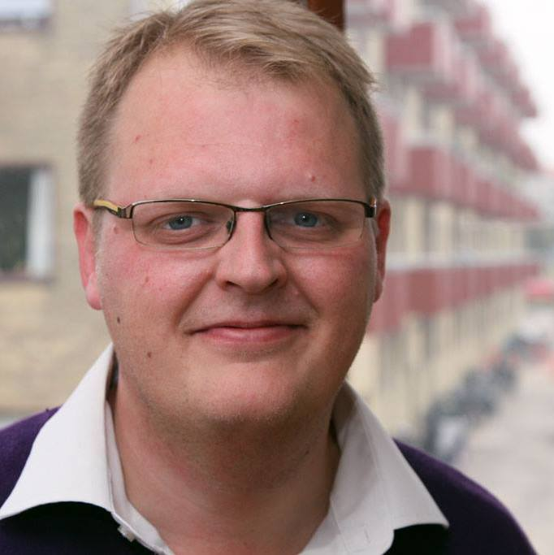

# CV

**Kristian Videmark Parkov**  
Født 9. august 1980  
Tranevej 15, 2. th.  
2400 København NV  
[LinkedIn](https://www.linkedin.com/in/kparkov/)  
[Bitkompagniet ApS](http://bitkompagniet.dk/)

---

Full-stack / backend udvikler med fokus på softwarearkitektur og ledererfaring. Startede min karriere med fokus på web, og har sidenhen bevæget mig hen mod mere komplicerede softwaresystemer indenfor medicin, forskning og administration. Jeg er klart stærkest indenfor backend-udvikling, men der er ofte en grænseflade til web i form af et REST API og f.eks. en React frontend.

Jeg startede i 2013 eget firma ([Bitkompagniet](http://bitkompagniet.dk)), og har her gennemført en række projekter både som leverandør og on-site konsulent, hvor jeg har spændt vidt i forhold til roller. Nogle projekter har jeg været ene om at gennemføre, i andre er jeg indgået som projektdeltager eller teknisk leder.

Jeg har fokus på proces og projektmodeller, og er tilhænger af test driven development, code reviews og et fornuftigt git flow.

Jeg bor i København med min kæreste Ida og vores datter Liva.

### Nøgleord

_Softwarearkitektur, C#, .NET, Javascript, PHP, SQL, MongoDB, REST API, Git, Docker, Test Driven Development (TDD), Ledelseserfaring, Kommunikation, Scrum_

# Erfaring

### Stifter og udvikler, Bitkompagniet ApS
**2013 - nu**

Tilbyder projekt- og konsulentbaserede ydelser i softwareudvikling, web og databaser, ofte med integrationer til andre systemer.

Eksempel-projekter:

- Kernemoduler til modellering af molekylær modellering og proteinstrukturer for [Novo Nordisk A/S](https://www.novonordisk.com/). _C# / .NET Core / class library_
- Selvbetjeningssystem til studielån på borger.dk. _C# / .NET / MVC_

[Se den fulde liste af projekter](#projekter).

### Lead-udvikler, MOC A/S
**2011 - 2013**

Team lead på et fire mands udviklingshold. Udvikling af web-applikationer og websites i TYPO3 CMS.

- Softwarearkitektur
- Kvalitetssikring af holdets udvikling
- Udvikling i PHP, javascript, HTML/CSS, MySQL
- Moduludvikling og website-implementering
- On-site konsulent i perioder

Projekter omfatter:

- DMI (Meteorologisk Institut) website re-implementering.
- VUC websites for 11 institutioner med fælles platform.
- Konsulent i TopDanmark i forbindelse med re-implementering af website.

### AC-fuldmægtig, IT-Universitetet i København
**2009 - 2011**

Strategisk rolle med fokus på trivsel og fremdrift. 

- Analyse af, og strategier for fremdrift.
- Planlægning og overordnet ansvar for studiestarten.
- Tilbagevendende lederansvar for de otte studenterstudievejledere.

# Uddannelse

### cand.it., Media Technology & games, IT-Universitetet i København
**2006 - 2009**

Udvalgte aktiviteter:

- Speciale i udvikling af rehabiliteringsværktøjer til afasi-patienter med inspiration fra spil. Karakter: 12.
- Samarbejde med Danmarks Radio om at lave nyhedsspil i Flash, der blev offentliggjort på DR's website.
- Kurser i kunstig intelligens, udvikling i 3D engines (Unity) og gamification.

### ba.soc., Communication & Computer Science, Roskilde Universitet
**2002 - 2005**

Udvalgte aktiviteter:

- Bacheloropgave i virtuelle rum som platform for samarbejde.
- Kurser i programmering (Java), SQL-databaser (SQL), Domain Driven Design, m.fl.
- Samfundsvidenskabelig basisuddannelse med fokus på kvantitativ analyse og økonomi.

# Projekter

### Kernemoduler til proteinmodellering, Novo Nordisk A/S

**Softwarearkitekt / Udvikler / On-site konsulent**

TODO: beskrivelse

_C#, .NET Core, XUnit_

### Bestillingsapplikation, Moderniseringsstyrelsen

**Softwarearkitekt / Udvikler**

Bestillingsapplikation til offentligt ansatte, der skal indkøbe materialer eller hotelophold gennem rammeaftaler. Først sammensættes kurven, derefter finder systemet den mest fordelagtige leverandør og sender ordren.

_C#, .NET MVC, JavaScript, MSSQL, HTML5 / Sass / CSS3, Foundation (CSS), Git_

### Aggregering af revenue-data, Relevant Media

**Softwarearkitekt / Teknisk projektleder / Udvikler**

Værktøj til aggregering og visualisering af revenue-data for udgivere, der præsenterer bannerreklamer fra en række forskellige kilder. Data synkroniseres og masseres til en samlet datamodel, der herefter er egnet til hurtige og fleksible forespørgsler. Microservice-arkitektur.

_Node.js, Express, MongoDB, ES6, React, Docker, Webpack, Git_

### Selvbetjening for medlemmer, Danske Fysioterapeuter

**Softwarearkitekt / Udvikler**

Selvbetjeningssystem til indmeldelse og administration for eksisterende medlemmer. Omfattende indsamling af data om medlem med komplicerede forgreninger. Integration med interne forretningssystemer (f.eks. Navision).

_C#, .NET MVC, .NET Web API, MSSQL, Navision, ES6, React, Redux, Git_

### Website build tool, Svift

**Teknisk rådgiver / Udvikler**

Værktøj til at lave hjemmesider uden teknisk viden, udbudt til private og små virksomheder. Microservice-arkitektur. Store frontend-udfordringer med krav om at kunne redigere og udskifte styles live.

_Node.js, Express, MongoDB, ES6, React, Redux, Docker, Git_

### Symbiosedatabase, Dansk SymbioseCenter

**Softwarearkitekt / Udvikler**

Produktionsvirksomheder har restressourcer, der hurtigt kan blive til spild. Projektets formål var at finde symbioser imellem virksomheder, hvor den ene virksomhed gerne vil anskaffe sig den andens restressource. Løst gennem en overskuelig database, der giver indblik i både ressourcen, og hvor langt den er væk.

_C#, .NET MVC, MySQL, MongoDB, JavaScript, Git_

### Studielån selvbetjening, Statens Administration

**Softwarearkitekt / Udvikler**

Udvikling af offentlig selvbetjeningsløsning til administration af private studielån på borger.dk. Her kan brugeren se sin restgæld, amortisation og bestille ændringer til afdraget. Kompliceret synkronisering med den database, der indeholder oplysninger om alle lånene.

_C#, .NET MVC, MSSQL, JavaScript, Git_

### Relevant Media

**Softwarearkitekt / Udvikler**

Udvikling af hub-platform til publicering af kampagner for annoncører på tværs af en række forskellige adservers. 

_Node.js, Express, MongoDB, ES6, React, Redux, Material Design, Webpack, Git_

### Danmarks Meteorologiske Institut (DMI)

**Softwarearkitekt / Lead developer / Underviser / Udvikler**

Etablering af nyt website baseret på TYPO3, samt opkvalificering af in-house udviklerne til at kunne udvikle komponenter til platformen.

_PHP, TYPO3, MySQL, JavaScript, jQuery, Git_

### Web-platform, VUC

**Softwarearkitekt / Lead developer / Underviser / Udvikler**

Etablering af fælles web-platform for 11 VUC-centre, samt plugin-udvikling til undervisningsplanlægning og studieadministration. Undervisning af VUC’s personale i brug af platformen.

_PHP, TYPO3, MySQL, JavaScript, jQuery, Git_

### Regnskabssystem til refusioner, Statens Administration

**Softwarearkitekt / Teknisk projektleder / Udvikler**

Udvikling af regnskabssystem til at styre offentlige refusioner i ØSC-området. Kompliceret datamodel og arbejdsgange, samt tunge beregninger og krav om præcision og sikkerhed.

_C#, .NET MVC, MSSQL, JavaScript, Git_

### Webshop til børnetøj, Ticket to Heaven

**Udvikler**

Vedligeholdelse og udvikling af mindre, nye features i TYPO3-baseret webshop.

_PHP, TYPO3, MySQL, JavaScript, Ember.js, jQuery, Git_

### TopDanmark

**Udvikler / On-site konsulent**

Udvikling af komponenter til selvbetjening på TopDanmarks hjemmeside i forbindelse med re-launch.

_PHP, TYPO3, MySQL, JavaScript, jQuery, Git_

### Website, Statens Museum for Kunst

**Udvikler**

Udvikling af komponenter til events og udstillinger til hjemmesiden.

_PHP, TYPO3, MySQL, JavaScript, jQuery,  Git_

### Website, Administrationshuset

**Lead developer / Udvikler**

Komponent-udvikling til administration af andelsforeninger.

_PHP, TYPO3, MySQL, JavaScript, jQuery, SVN_

# Side-projekter

Non-profit eller 

### Launch, Public Ally

Et fejlet startup, der handlede om at lave et projektsystem til administration af offentlige udbudsprocesser.

### C# kursus

### Green footsteps, Roskilde festival

Et dokumentationssystem til godkendelse af "green achievements", hvor festivaldeltagere, der ønskede at bo i festivalens grønne camp kunne få adgangskravene godkendt. Adgangskravene omfattede f.eks. at indlevere en bestemt mængde pant, sortere affald eller lignende. For at bestå, skulle de enkelte benspænd modsvares af beskrivelse og fotodokumentation.

### Website, Pantbørsen

### Website, Iværksætterhjælpen

### Website, Transmogriffen

### Cards